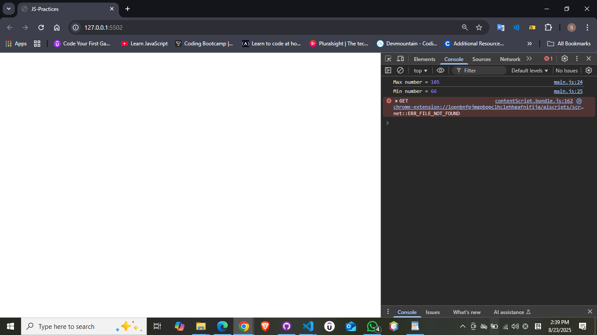

# Lab1-JS
JavaScript basic problems for practice
- Practice JavaScript basics (variables, loops, conditions, switch).

## 🛠️ Technologies Used
- HTML  
- **JavaScript**

--- --- --- --- ---

##  Problem Statement
1. Write a program that allow to user enter number then print it.
2. Write a program that take number from user then print yes if that number can divide by 3 and 4 otherwise print no.
3. Write a program that allows the user to insert **two integers** and then print the maximum of them. If both numbers are equal, print a message indicating equality.
4. Write a program that allows the user to insert an integer then print negative if it is negative number otherwise print positive.
5. Write a program that take **3 integers** from user then **print the max element and the min element**.
6. Write a program that allows the user to insert integer number then check If a number is **oven or odd**.
7. Write a program that take character from user then if it is vowel chars **(a,e,I,o,u)** then print vowel otherwise print consonant.
8. Write a program that allows user to insert integer then print all numbers between 1 to that’s number.
9. Write a program that allows user to insert integer then print a **multiplication table up to 12**.
10. Write a program that allows to user to insert number then **print all even numbers between 1 to this number**.
11. Write a program that take **two integers** then print the **power**.
12. Write a program to enter marks of **five subjects** and calculate total, average and percentage.
13. Write a program to input marks of five subjects Physics, Chemistry, Biology, Mathematics and Computer, **Find percentage and grade**.
14. Write a program to input month number and print number of days in that month. 
15. Write a program to print total number of days in month
16. Write a program to check whether an alphabet is vowel or consonant
17. Write a program to find maximum between two numbers
18. Write a program to check whether a number is even or odd
19. Write a program to check whether a number is positive or negative or zero
20. Write a program to create Simple Calculator

----------------------------------------------------------------------------------------------------------------

## 📸 Screenshot Example

Here is a sample output of the program number 5:

